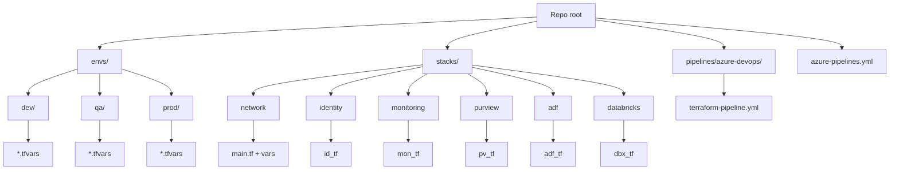
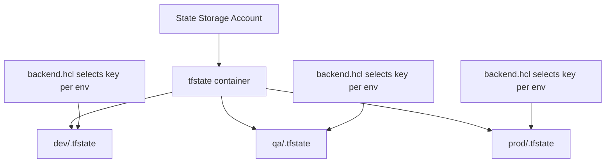
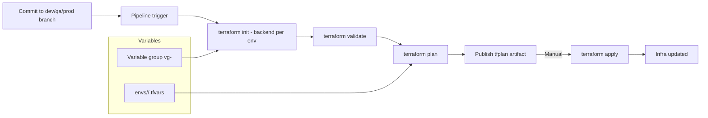
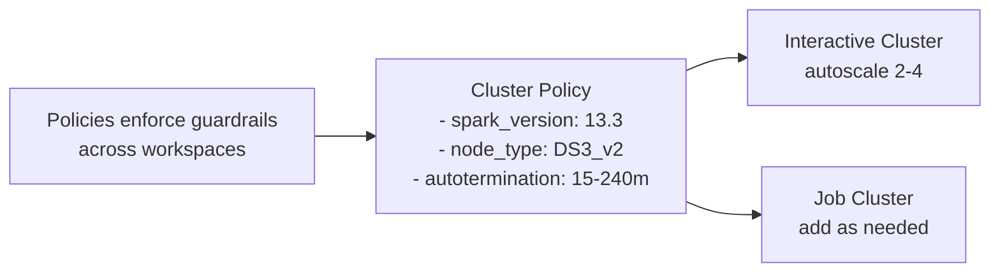

# Instant Azure Data Platform with Reusable Terraform

This wiki explains how to deploy the full platform (network, monitoring, Purview, ADF, Databricks) using the reusable Terraform stacks and Azure DevOps pipeline.

## Architecture (Stacks and Flows)
```mermaid
flowchart LR
    subgraph Net[Network Stack]
      RG1[Resource Group]
      VNet[Virtual Network]
      S1[Subnets: private/public/pe]
      RG1 --> VNet --> S1
    end
    subgraph Monitor[Monitoring Stack]
      RG2[Monitoring RG]
      LAW[Log Analytics]
      APP[App Insights]
      RG2 --> LAW
      RG2 --> APP
    end
    subgraph Purview[Purview Stack]
      RG3[Purview RG]
      PV[Purview Account]
      RG3 --> PV
    end
    subgraph ADF[ADF Stack]
      RG4[ADF RG]
      ADF1[Data Factory]
      KV[Key Vault LS]
      ADLS[ADLS LS]
      RG4 --> ADF1
      ADF1 --> KV
      ADF1 --> ADLS
    end
    subgraph DBX[Databricks Stack]
      RG5[DBX RG]
      WS[Workspace - VNet injected, no public IP]
      POL[Cluster Policy]
      CL[Interactive Cluster]
      RG5 --> WS --> POL
      WS --> CL
    end

    VNet -.-> WS
    S1 -.-> WS
    LAW <-- diagnostics --> WS
    LAW <-- diagnostics --> ADF1
    LAW <-- diagnostics --> PV
    ADLS -. data -> DBX
    ADLS -. data -> ADF1
```

## Repo Layout


- Pipeline dispatcher: [azure-pipelines.yml](azure-pipelines.yml).
- Pipeline template: [pipelines/azure-devops/terraform-pipeline.yml](pipelines/azure-devops/terraform-pipeline.yml).
- Stacks: [stacks](stacks) folder; per stack run `terraform -chdir=stacks/<stack>`.
- Env inputs: [envs/dev](envs/dev), [envs/qa](envs/qa), [envs/prod](envs/prod) tfvars and backend.hcl.

## Terraform State Strategy


## Azure DevOps Flow


- Branch name maps to env: dev → dev, qa → qa, prod → prod.
- Variable groups: create `vg-dev`, `vg-qa`, `vg-prod` with `backend_rg`, `backend_sa`, `backend_container`, plus secrets.
- Apply is manual-gated; add approvals for prod.

## Databricks Guardrails


## Setup Steps
1) Prereqs
- Ensure Terraform 1.9.x available in agents (pipeline uses UseTerraform task).
- Create state RG + storage account + container; enable soft delete + versioning.
- Service connection needs: contributor on target RGs, User Access Administrator for RBAC, directory read; Databricks access as needed.

2) Configure variables
- Populate tfvars with real IDs:
  - Network: VNet/subnet CIDRs and RG in [envs/dev/network.tfvars](envs/dev/network.tfvars) (repeat for qa/prod).
  - Databricks: VNet/subnet IDs, RGs, AAD admin group in [envs/dev/databricks.tfvars](envs/dev/databricks.tfvars).
  - ADF: Key Vault and ADLS resource IDs in [envs/dev/adf.tfvars](envs/dev/adf.tfvars).
  - Monitoring/Purview/Identity: fill RGs, tags, group IDs in respective tfvars.
- Backend configs: [envs/dev/backend.hcl](envs/dev/backend.hcl) (qa/prod counterparts).
- Variable groups `vg-<env>`: backend values and any secrets (e.g., SP client secret if not managed identity).

3) Local dry run (optional)
- `terraform -chdir=stacks/network init -backend-config=../../envs/dev/backend.hcl`
- `terraform -chdir=stacks/network plan -var-file=../../envs/dev/network.tfvars`

4) Run in Azure DevOps
- Start pipeline [azure-pipelines.yml](azure-pipelines.yml); choose `stack` parameter.
- Branch determines env; plan runs automatically; apply requires manual confirmation (and approvals on prod).

## Stack Responsibilities
- Network: RG, VNet, subnets (private/public/PE). Extend with private endpoints, DNS zones, NSGs/UDRs as needed.
- Identity: AAD group IDs pass-through (add memberships/role assignments as you evolve).
- Monitoring: Log Analytics + App Insights; attach diagnostics from other stacks to workspace as needed.
- Purview: Purview account via azapi; add private endpoints and DNS.
- ADF: Factory (no public network), managed VNet toggle, Key Vault/ADLS linked services referencing KV secrets.
- Databricks: Workspace (no public IP, VNet injection), admin group assignment, baseline cluster policy, sample interactive cluster; add jobs, pools, tighter policies as needed.

## Security and Approvals
- Keep secrets in Key Vault; reference via variable groups linked to KV.
- Restrict service connection scope to the deployment RGs; prod requires approvals.
- Use cluster policies to constrain SKU/runtime/auto-termination; enable diagnostic logs to Log Analytics.

## Tips for Extending
- Add private endpoints and DNS zones for Storage, Key Vault, Databricks, Purview, ADF.
- Add Databricks jobs and pools; store notebooks in repo and sync via `databricks_repo` or jobs with git references.
- Add ADF datasets/pipelines as code; keep secrets out of JSON by using Key Vault references.
- Add module wrappers if you need to reuse patterns across stacks.
